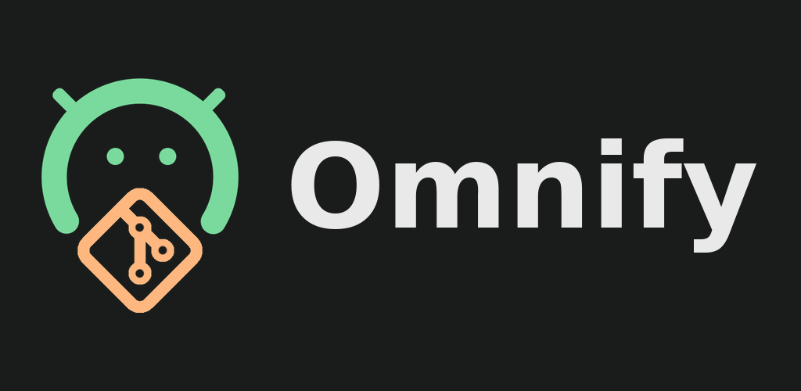

> [!WARNING]
> **Free and Open-Source Android is under threat.**
>
> Google plans to turn Android into a more locked-down platform, restricting your essential freedom to install the apps of your choice. Make your voice heard:
> [**Keep Android Open**](https://keepandroidopen.org/).

<div align="center">



### Droidify Enhanced

**A clutter-free F-Droid client — now able to install apps from anywhere, translate descriptions, and built on a modern Material You interface.**

_Enhanced fork maintained by [Victor-root](https://github.com/Victor-root) — based on [Droid-ify](https://github.com/Droid-ify/client) by LooKeR._

[](https://github.com/Victor-root/Droidify-enhanced/releases/latest)
[](https://github.com/Victor-root/Droidify-enhanced/releases/)
[](https://github.com/Victor-root/Droidify-enhanced/stargazers)
[](LICENSE)

</div>

---

## 📸 Screenshots

<!--
  Replace the four images below with up-to-date screenshots of the Enhanced UI.
  Drop the files in metadata/en-US/images/phoneScreenshots/ (1.png … 4.png),
  or add more  tags. Keep width ≈ 24% so they sit four-per-row on GitHub.
-->

<div align="center">


</div>

---

## Why this fork?

[Droid-ify](https://github.com/Droid-ify/client) is an excellent, clean F-Droid
client. **Droidify Enhanced** keeps that spirit and pushes it further, with one
goal: be a daily-driver app store that is **more capable**, **more modern**, and
**rock-solid reliable**.

In practice that means three things upstream doesn't do:

1. **Install apps that live in no repository.** Lots of great apps are only
   published as GitHub releases. Enhanced lets you add them as *external sources*
   and treats them like any other app — install, update notifications and all —
   without you ever leaving the app.
2. **A genuinely modern interface.** The UI was rebuilt from the ground up in
   Jetpack Compose with Material You: a Discover home, dynamic accent colours, a
   collapsing header, smooth animations and an edge-to-edge layout.
3. **Read any app, in your language.** A built-in translator turns an app's
   summary and description into your device language on demand — online, on a
   server you host, or **fully offline on-device**, your choice.

On top of that, a large amount of work went into **stability, performance and
security** (see the sections below).

---

## ✨ What's new in Enhanced

### 📦 Install apps from anywhere — *External sources*

Add a code-hosting repository (e.g. a project's GitHub page) and install &
update its app **straight from its releases**, with no F-Droid repository
required. Enhanced does the tedious parts for you:

- **Picks the right APK automatically** for your device's CPU architecture, with
  an optional **name filter** when a release ships several files.
- **Falls back to an older release** when the latest one has no APK compatible
  with your device.
- **Shows the real app name and icon *before* installing** — read from the
  project's manifest and resources, not just the repository name.
- **A visual icon picker** when several icons are found in the source.
- **Surfaces updates in the Updates tab**, with device-aware checks and clear
  signature-conflict handling.
- **Renders the project README** inside the app (images and links included).
- **Editable per-source settings**: custom name, opt into pre-releases, or mute
  a source's updates.
- **Optional GitHub token** to lift the anonymous API rate limit — with built-in
  help explaining how to create a **no-scope token that grants nothing on your
  account**.
- **Backed up** with the rest of your settings (export / import).

### 🎨 A modern Material You interface

- Rebuilt entirely in **Jetpack Compose** with **Material 3**.
- **Accent-colour picker**, including an option that follows your **wallpaper**
  (real Material You colour).
- Accent-tinted status & navigation bars, an **edge-to-edge** toggle, and a
  header that **collapses as you scroll**.
- Two-column card grid, animated search that slides in from the header, and
  **wavy progress indicators** throughout.

### 🧭 A Discover home

A curated landing screen with **carousels** (what's new, recently updated, most
downloaded) and a browsable **categories** section — so finding something new
feels like a real store.

### 🌍 Built-in description translation

A **Translate** button in the app header renders the **summary and description**
in your device language. Pick the engine that matches your privacy preference in
Settings:

- a fast **online** translator,
- a **self-hostable, open-source** server you point it at,
- or **fully on-device, offline** translation that downloads its language pack
  only when you ask for it.

An optional **auto-translate** toggle does it automatically whenever an app isn't
already in your language. **Nothing is downloaded until you choose the on-device
engine** — no bloat, no surprises.

---

## 🛡️ Security & privacy

- **Signing certificate verified** against the repository index **before** an
  install proceeds.
- **Anti-feature warnings** and the full **runtime-permission list** are shown on
  the app detail screen.
- A badge **flags apps that depend on proprietary Google services**, so you know
  before you install.
- The optional GitHub token is **scope-less** — it only raises the API rate
  limit and can do nothing else on your account.
- Translation can be **100% offline** if you choose the on-device engine.

---

## 🔧 Stability & bug fixes

Reliability was a first-class goal. Highlights:

**Performance**
- Unified the whole data layer on a single **Room** database and removed the
  legacy SQLite database, sync service, downloader and index parser.
- Moved list and screen-state work **off the main thread** and stopped redundant
  state emissions.
- Added a **baseline profile** for faster cold starts and smoother first scroll.
- Fixed a **freeze (ANR)** on the app detail screen.

**Large catalogues**
- Oversized repository rows no longer exceed the SQLite cursor-window limit
  (which could previously crash the list).
- APK validation now runs off the main thread.

**Sync**
- Automatic **re-sync after a database reset**.
- Fixed a case where a sync could silently finish with an **empty catalogue**.
- The index is downloaded to a **fresh file** each time.
- A clear **fetching state on first launch**, and the UI stays responsive while
  that first (large) sync runs.
- The foreground sync notification is **throttled** so it no longer flickers.

**Updates & installs**
- System-app updates that **can't be installed** are hidden.
- Stopped the repeated **uninstall-prompt loop** for system apps signed with a
  different key.
- A downloaded APK is **reused** after uninstalling a signature-conflicting
  version — no needless re-download.

---

## 🌐 Language

Enhanced ships a complete, **formal French** translation in addition to English,
and inherits the other languages from upstream. Contributions for more languages
are welcome.

---

## 🚀 Get started

**Download:** grab the latest APK from
[**GitHub Releases**](https://github.com/Victor-root/Droidify-enhanced/releases/latest).

**Build from source:** see the [Building Guide](docs/building.md).

> Requires Android 6.0 (API 23) or newer.

---

## 🙏 Built on the shoulders of giants

Droidify Enhanced exists thanks to the work that came before it:

- **[Droid-ify](https://github.com/Droid-ify/client)** by **LooKeR** — the base
  this fork builds on.
- **[Foxy-Droid](https://github.com/kitsunyan/foxy-droid)** by **kitsunyan** —
  the original client Droid-ify itself grew from.

Huge thanks to both projects and their contributors.

---

## 🤝 Contributing

Issues and pull requests are welcome. If you're setting up a dev environment,
start with the [Building Guide](docs/building.md) and the
[Contributing Guide](CONTRIBUTING.md).

---

## 📄 License

```
Droidify Enhanced — a fork of Droid-ify

Copyright (C) 2025 LooKeR (original Droid-ify)
Copyright (C) 2026 Victor-root (Droidify Enhanced fork)

This program is free software: you can redistribute it and/or modify
it under the terms of the GNU General Public License as published by
the Free Software Foundation, either version 3 of the License, or
(at your option) any later version.

This program is distributed in the hope that it will be useful,
but WITHOUT ANY WARRANTY; without even the implied warranty of
MERCHANTABILITY or FITNESS FOR A PARTICULAR PURPOSE. See the
GNU General Public License for more details.

You should have received a copy of the GNU General Public License
along with this program. If not, see <http://www.gnu.org/licenses/>.
```
